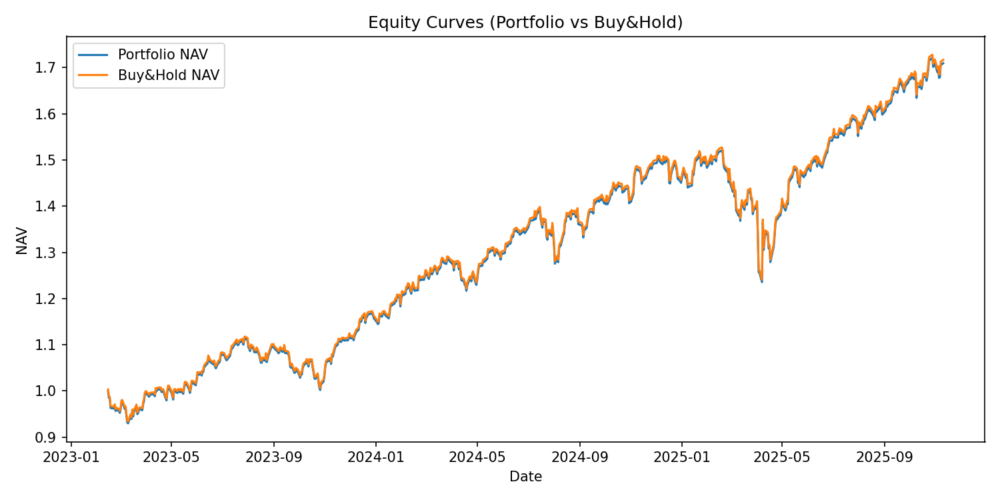
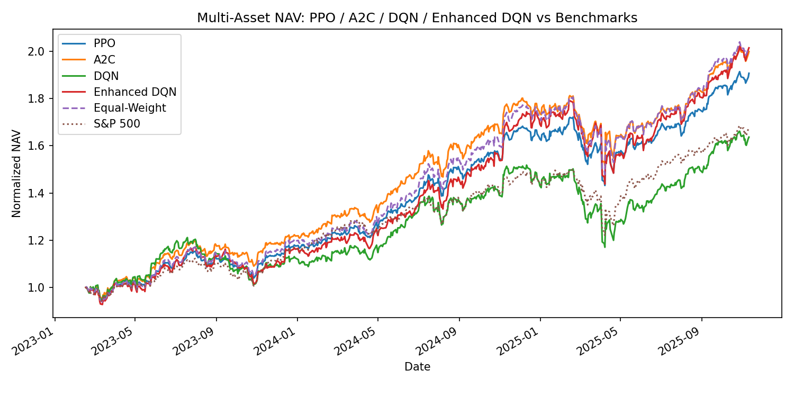
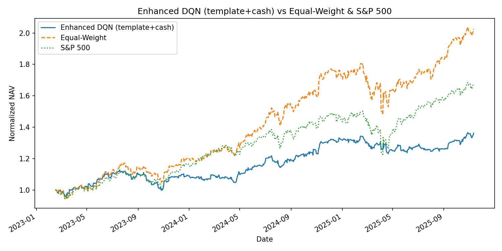
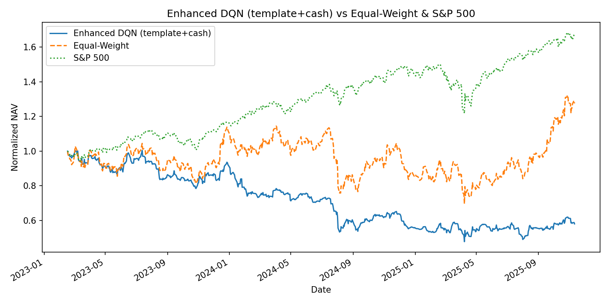
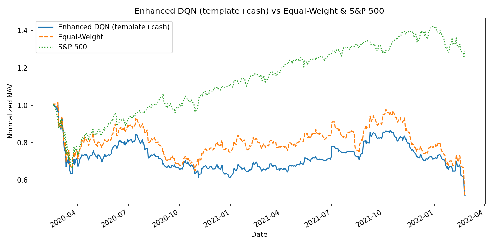

# RL Project Group 4 – Deep RL for Portfolio Management

This repository contains the code for a course project on **deep reinforcement learning (RL) for trading and portfolio management**.  

We go from **single-asset SPY trading** to **multi-asset portfolio allocation**, and finally to a **cash-aware portfolio with different market regimes** (uptrend / range-bound / downtrend).

The main focus is on comparing:

- Classic policy-gradient RL (PPO, A2C)
- Value-based RL (DQN)
- An **enhanced DQN** with dueling architecture + Double Q-learning + prioritized replay + template-based portfolio actions

across different asset universes and market conditions.

> **Data Period Used in Experiments**  
> Unless otherwise specified, all experiments in this project use:  
> - **Training period:** 2010-01-01 to 2022-12-31  
> - **Evaluation period:** 2023-01-01 to 2025-11-12  
>  
> The example commands below are written to match this split.

---

## 1. Repository Structure

At the top level you will see:

```text
RL_project_group4/
├── model/          # Saved models (trained PPO / DQN / enhanced DQN weights)
├── result/         # Backtest results: equity curves, CSV logs, metrics tables, comparison plots
└── src/            # All source code
```

Inside `src/` the structure is:

```text
src/
├── data/
│   ├── single_asset_loader.py      # Load SPY or other single-asset OHLCV with yfinance
│   └── multi_asset_loader.py       # Load price matrices for multiple tickers, build return matrices
│
├── envs/
│   ├── single_asset_env.py         # Gymnasium env for single-asset continuous position [-1, 1]
│   ├── multi_asset_portfolio_env.py# Multi-asset env without explicit cash (weights sum to 1 across stocks)
│   ├── multi_asset_template_env.py # Multi-asset env with discrete “template” actions (PPO-free / DQN baseline)
│   └── multi_asset_template_cash_env.py
│       # New: multi-asset + explicit cash dimension, with discrete templates (keep, growth tilt, defensive tilt, high cash)
│
├── models/
│   ├── train_single_ppo.py         # Train PPO agent on single asset (e.g., SPY)
│   ├── train_single_a2c.py         # (if used) Train A2C agent on single asset
│   ├── train_single_dqn.py         # Train DQN on single asset (discrete position changes)
│   ├── train_multi_ppo.py          # Train PPO on multi-asset portfolio (no cash)
│   ├── train_multi_a2c.py          # Train A2C on multi-asset portfolio (no cash)
│   ├── train_multi_dqn.py          # Train vanilla DQN on multi-asset (no cash)
│   ├── train_enhanced_dqn.py       # Enhanced DQN for multi-asset portfolio (no cash)
│   └── train_enhanced_dqn_template_cash.py
│       # Enhanced DQN with discrete templates + explicit cash (uptrend / range / downtrend experiment)
│
├── backtest/
│   ├── evaluate_single_asset.py               # Evaluate PPO / DQN / baseline on SPY
│   ├── evaluate_multi_asset.py                # Evaluate multi-asset algorithms vs equal-weight & S&P 500
│   ├── evaluate_enhanced_dqn.py               # Evaluate enhanced DQN (no cash) vs PPO / A2C / vanilla DQN
│   ├── evaluate_enhanced_dqn_template_cash.py # Evaluate enhanced DQN (template + cash) in three regimes
│   └── plot_multi_algos_nav.py                # Combine NAV curves from multiple algorithms into one figure
│
└── utils/
    ├── metrics.py                  # Annualized return, volatility, Sharpe, max drawdown, etc.
    └── plotting.py                 # Helpers for equity curves and diagnostic plots
```

> **Note:** The exact filenames may evolve slightly. If you rename any script in the repo, just update the README commands accordingly.

---

## 2. Environment Setup & How to Run

### 2.1. Python environment

You can use `venv`, `conda`, or `mamba`. Example with `venv`:

```bash
git clone https://github.com/VincentFangWB/RL_project_group4.git
cd RL_project_group4

# Python 3.10+ recommended
python -m venv .venv
source .venv/bin/activate          # Windows: .venv\Scripts\activate

pip install --upgrade pip

# Install dependencies
pip install -r requirements.txt
```

---

### 2.2. Example 1 – Train & Evaluate PPO on Single Asset (SPY)

In this example we strictly follow the global data split:

- **Training:** 2010-01-01 to 2022-12-31  
- **Evaluation:** 2023-01-01 to 2025-11-12  

#### Train PPO on SPY (2010-01-01 to 2022-12-31)

```bash
python -m src.models.train_single_ppo   --ticker SPY   --start 2010-01-01   --end   2022-12-31   --train-end 2022-12-31   --window 30   --transaction-cost 0.001   --total-timesteps 300000   --save-dir model/ppo_spy   --tensorboard-log tb_logs/ppo_spy
```

Typical flags:

- `--ticker`: symbol to trade (SPY)  
- `--start` / `--end`: full dataset range used for training  
- `--train-end`: last date used for training (here equal to `--end`)  
- `--window`: lookback window (days) for state features  
- `--transaction-cost`: proportional cost per unit turnover  
- `--total-timesteps`: number of RL environment steps  
- `--save-dir`: where to store `model.zip` and logs  

#### Evaluate PPO on SPY (2023-01-01 to 2025-11-12)

```bash
python -m src.backtest.evaluate_single_asset   --ticker SPY   --start 2023-01-01   --end   2025-11-12   --window 30   --algo ppo   --model-path model/ppo_spy/model.zip   --transaction-cost 0.001   --out-dir result/eval_spy_ppo
```

This will typically write into `result/eval_spy_ppo/`:

- `equity_curve.png` – NAV of PPO vs SPY buy-and-hold  
- `actions.csv` – daily position / action / reward  
- `metrics_table.txt` – cumulative return, annualized return, volatility, Sharpe, max drawdown  

You can rerun the evaluation with `--algo dqn` and `--model-path` pointing to your DQN model to compare.

---

### 2.3. Example 2 – Train & Evaluate Multi-Asset PPO (No Cash, Uptrend Basket)

Here we use 10 “mostly uptrend” large caps, with the same time split:

- **Training:** 2010-01-01 to 2022-12-31  
- **Evaluation:** 2023-01-01 to 2025-11-12  

The uptrend basket:

> `NVDA, AAPL, TSLA, GS, BAC, XOM, WMT, KO, UNH, MCD`

#### Train PPO on multi-asset portfolio (2010-01-01 to 2022-12-31)

```bash
python -m src.models.train_multi_ppo   --tickers "NVDA,AAPL,TSLA,GS,BAC,XOM,WMT,KO,UNH,MCD"   --start 2010-01-01   --end   2022-12-31   --window 30   --transaction-cost 0.001   --risk-lambda 0.1   --rolling-window 30   --max-steps 2000   --total-timesteps 300000   --n-envs 4   --learning-rate 3e-4   --batch-size 2048   --gamma 0.99   --ent-coef 0.0   --clip-range 0.2   --save-path model/ppo_multi_up/model.zip   --tensorboard-log tb_logs/ppo_multi_up
```

#### Evaluate multi-asset PPO vs equal-weight & S&P 500 (2023-01-01 to 2025-11-12)

```bash
python -m src.backtest.evaluate_multi_asset   --algo ppo   --model-path model/ppo_multi_up/model.zip   --tickers "NVDA,AAPL,TSLA,GS,BAC,XOM,WMT,KO,UNH,MCD"   --start 2023-01-01   --end   2025-11-12   --window 30   --transaction-cost 0.001   --risk-lambda 0.1   --rolling-window 30   --max-steps 2000   --out-dir result/eval_multi_ppo_up
```

Outputs:

- RL NAV vs **equal-weight portfolio** (1/N across the 10 stocks)  
- NAV vs **S&P 500** (ticker `^GSPC`)  
- Metrics table for all three  

You can run the same evaluation with `--algo dqn` or by calling 
`evaluate_enhanced_dqn.py` to compare PPO / A2C / vanilla DQN / **enhanced DQN**.

---

### 2.4. Example 3 – Train & Evaluate Enhanced DQN with Cash (Three Market Regimes)

For the “cash-aware” experiment, we use a **template-based discrete action env** with cash and keep the same global time split:

- **Training:** 2010-01-01 to 2022-12-31  
- **Evaluation:** 2023-01-01 to 2025-11-12  

**Baskets**

- **Uptrend basket (10 stocks)**:  
  `NVDA,AAPL,TSLA,GS,BAC,XOM,WMT,KO,UNH,MCD`
- **Range-bound basket (3 stocks)**:  
  `INTC,F,AA`
- **Downtrend basket (2 stocks)**:  
  `VEON,PRGO`

#### Train enhanced DQN (template + cash, 2010-01-01 to 2022-12-31)

```bash
# Uptrend
python -m src.models.train_enhanced_dqn_template_cash   --tickers "NVDA,AAPL,TSLA,GS,BAC,XOM,WMT,KO,UNH,MCD"   --start 2010-01-01   --end   2022-12-31   --total-timesteps 1000000   --save-path model/enhanced_dqn_cash_up.pt

# Range
python -m src.models.train_enhanced_dqn_template_cash   --tickers "INTC,F,AA"   --start 2010-01-01   --end   2022-12-31   --total-timesteps 1000000   --save-path model/enhanced_dqn_cash_range.pt

# Downtrend
python -m src.models.train_enhanced_dqn_template_cash   --tickers "VEON,PRGO"   --start 2010-01-01   --end   2022-12-31   --total-timesteps 1000000   --save-path model/enhanced_dqn_cash_down.pt
```

Each action chooses one of a small set of **portfolio templates**:

- keep current weights  
- equal-weight all stocks (0% cash)  
- growth tilt vs defensive tilt  
- high-cash template (e.g., 70% cash, 30% risky assets)  

This is designed to test whether the DQN can **“hide in cash”** during downtrends.

#### Evaluate enhanced DQN vs equal-weight & S&P 500 (2023-01-01 to 2025-11-12)

```bash
# Example: downtrend basket
python -m src.backtest.evaluate_enhanced_dqn_template_cash   --model-path model/enhanced_dqn_cash_down.pt   --tickers "VEON,PRGO"   --start 2023-01-01   --end   2025-11-12   --window 30   --transaction-cost 0.001   --risk-lambda 0.1   --rolling-window 30   --max-steps 2000   --max-steps 2000   --out-dir result/eval_enhanced_dqn_cash_down
```

Outputs include:

- `equity_curve_enhanced_dqn_template_cash.png`  
- `actions_enhanced_dqn_template_cash.csv` (with `w_cash` column)  
- `metrics_table_enhanced_dqn_template_cash.txt`  

---

## 3. Experiments & Findings

### 3.0. Overall Experimental Logic

The experimental design follows a step-by-step logic:

1. **Start with a single broad index (SPY) and pure timing.**  
   First we ask: if an RL agent is allowed to time **only SPY** (no other assets), can it learn a trading policy that beats SPY buy-and-hold over a long horizon?

2. **Then move to a multi-asset uptrend universe.**  
   Next we expand to a **basket of 10 large-cap stocks** in a long-term uptrend. RL can freely allocate weights among these stocks. The question becomes: can RL exploit cross-sectional information (relative winners/losers) to beat a simple **equal-weight** portfolio and broad market benchmarks?

3. **Finally, test enhanced DQN in different regimes (uptrend, range, downtrend) with cash.**  
   We realized that the first two experiments are mainly in **long bull markets**, which are very friendly to buy-and-hold and equal-weight. To stress-test the method, we create separate universes for **uptrend, range-bound, and downtrend** regimes, add an explicit **cash position**, and see whether an **enhanced DQN** can meaningfully adjust risk (e.g., stay in cash) and outperform equal-weight in these more challenging conditions.

All experiments use the same **train/eval split**:

- **Training:** 2010-01-01 to 2022-12-31  
- **Evaluation:** 2023-01-01 to 2025-11-12  

---

### 3.1. Experiment 1 – Single-Asset SPY (PPO / A2C / DQN vs Buy & Hold)

**Setup**

- Asset: **SPY** (S&P 500 ETF)  
- Algorithms: PPO, A2C, DQN  
- Environment: single-asset continuous position in `[-1, 1]` (short to long), daily rebalancing  
- Training period: **2010-01-01 to 2022-12-31**  
- Evaluation period: **2023-01-01 to 2025-11-12**  
- Baseline: SPY **buy-and-hold**  

**Empirical result**




In this setup, all three algorithms (PPO, A2C, DQN):

- converge to policies that are essentially **long-only buy-and-hold SPY** in the out-of-sample period, and  
- the equity curves of the learned policies **almost perfectly overlap** with the SPY buy-and-hold curve during evaluation.

In other words, the “best” policies they discover are **indistinguishable from buy-and-hold** at the time scale and cost structure we use.

**Why do all three algorithms converge to buy-and-hold?**

1. **SPY is a long-term uptrend; buy-and-hold is near-optimal.**  
   Over 2010-01-01 to 2025-11-12, SPY exhibits a strong long-run upward drift despite corrections. If you penalize transaction costs and risk, the globally optimal policy in a single-asset setting is “**be long most of the time and don’t trade too much**.” Trying to time every wiggle tends to hurt performance.

2. **Reward structure discourages over-trading.**  
   The reward integrates both return and risk (volatility / drawdown) and subtracts transaction costs. Any strategy that frequently switches between long / flat / short needs very high prediction accuracy to beat the simple “stay long” approach. The agents quickly “learn” that trading too much reduces cumulative reward, and settle into a stable, low-turnover policy.

3. **Limited information and noisy signals.**  
   The state is built from past prices/indicators of a single index. Predictability is weak; most patterns are indistinguishable from noise. For PPO/A2C, the policy gradient signal pushes the policy toward a robust mode of behavior that works across many trajectories: **stay long**.  
   For DQN, the Q-values associated with being long almost always dominate those for other actions, leading it to favor a near-constant long position.

4. **Clipping and regularization effects (especially for PPO).**  
   Policy gradient methods like PPO use clipping and entropy to keep policies from making large, unstable updates. When combined with a strong upward trend and transaction costs, the policy tends to “lock in” to a region of the parameter space corresponding to **persistent long exposure**.

**Takeaway:**  
On a single efficient index like SPY, over a long bull market, RL essentially **rediscovers buy-and-hold** as the optimal strategy. The fact that the RL equity curves lie almost exactly on top of buy-and-hold is an empirical confirmation of this.

---

### 3.2. Experiment 2 – Multi-Asset Uptrend, No Cash  
**(NVDA,AAPL,TSLA,GS,BAC,XOM,WMT,KO,UNH,MCD)**

**Setup**

- 10 large caps with strong long-term performance.  
- Algorithms: **PPO, A2C, vanilla DQN, enhanced DQN (Double-Dueling + PER + templates)**.  
- No explicit cash: the agent always stays fully invested across the 10 stocks.  
- Training period: **2010-01-01 to 2022-12-31**  
- Evaluation period: **2023-01-01 to 2025-11-12**  
- Baselines:
  - **Equal-weight (1/N) portfolio** across the 10 names.  
  - **S&P 500** as an external benchmark.

**Empirical result**



- The **equal-weight portfolio** across these 10 strong performers is already very strong.  
- PPO and A2C produce reasonable allocations but generally **do not convincingly beat** the equal-weight benchmark on a risk-adjusted basis.  
- Vanilla DQN tends to over-react and is often unstable, leading to performance that is similar to or worse than equal-weight.  
- **Only the enhanced DQN** (with dueling architecture, Double Q-learning, prioritized replay, and template actions) manages to **barely outperform** the equal-weight portfolio in our chosen evaluation window—and the margin is modest.

So even in this carefully chosen, favorable universe, enhanced DQN **only slightly** beats equal-weight, and the other RL methods generally do not.

**Why is it so hard for DQN to beat equal-weight in portfolio management?**

1. **Equal-weight is a very strong, robust baseline.**  
   The “1/N” portfolio is known to be surprisingly competitive because it does not rely on noisy estimates of expected returns or covariances. Any model, including DQN, must generate a **consistent and sizable edge** to improve on 1/N after costs and volatility.

2. **Q-learning struggles with noisy, high-dimensional, long-horizon problems.**  
   Portfolio returns are noisy and multi-step: today’s action affects risk and returns for a long time. Bootstrapped value estimates (Q-targets) inherit this noise, which can destabilize learning. Even with dueling + Double Q-learning + PER, the effective signal-to-noise ratio is low, making it hard for DQN to learn subtle allocation edges over 1/N.

3. **Small edge vs. large estimation error.**  
   Even if some assets have slightly higher risk-adjusted returns than others, that edge is often very small compared to daily volatility. DQN has to estimate Q-values with enough precision to reliably tilt toward those assets, but function approximation error and limited samples can overwhelm the benefit. In contrast, equal-weight does not try to “optimize” anything—so it doesn’t suffer from estimation error in the same way.

4. **Overfitting and regime sensitivity.**  
   A DQN policy might pick up patterns that work in the training period but don’t generalize perfectly into 2023–2025. Equal-weight, being simple and static, is much less sensitive to regime changes or mis-specified patterns.

5. **Transaction costs and turnover.**  
   DQN’s discrete actions can result in relatively frequent portfolio shifts, especially if the Q-function is noisy. Even modest turnover can erode any small edge it finds. We mitigate this with template actions and risk-aware rewards in the enhanced DQN, which is likely why it **barely** beats equal-weight, while vanilla DQN typically fails to do so.

**Takeaway:**  
DQN-based portfolio management faces a double hurdle: it must extract very small edges from noisy data, and those edges must be strong enough to overcome estimation error, regime shifts, and transaction costs. Against this, equal-weight is a tough opponent, which explains why even the enhanced DQN only manages a **slight** outperformance.

---

### 3.3. Experiment 3 – Three Market trends with Cash  
**(Enhanced DQN, template actions + cash)**

**Baskets**

- **Uptrend (10 stocks)** – same as above:  
  `NVDA,AAPL,TSLA,GS,BAC,XOM,WMT,KO,UNH,MCD`  
- **Range-bound (3 stocks)**:  
  `INTC,F,AA`  
- **Downtrend (2 stocks)**:  
  `VEON,PRGO`  

**Environment**

- There is now a **cash dimension**:
  - Weights over `N` stocks + 1 cash = 1.  
  - One of the discrete templates is **“high cash”** (e.g., 70% cash, 30% risky assets).  
- Enhanced DQN chooses among 5 templates:
  - keep current weights  
  - equal-weight all stocks  
  - growth tilt  
  - defensive tilt  
  - high-cash  

**Empirical pattern (qualitative)**

Across **all three regimes (train: 2010-01-01 to 2022-12-31, eval: 2023-01-01 to 2025-11-12)**, enhanced DQN (template + cash) **does not consistently beat the equal-weight benchmark**:



- **Uptrend basket (with cash):**
  - RL sometimes holds too much cash during strong uptrends,
  - or rotates between styles too often, incurring transaction costs.
  - Equal-weight fully invested in strong names remains very competitive.



- **Range-bound basket:**
  - Market has no clear trend; price noise dominates.
  - Any attempt to time short-term moves tends to generate churn and costs.
  - Equal-weight with low turnover is again robust.



- **Downtrend basket:**
  - Ideally, DQN **should** learn to stay near the high-cash template most of the time.
  - In practice, it often:
    - over-reacts to short bear-market rallies,
    - oscillates between “risk-on” and “risk-off” templates,
    - and never perfectly learns “just stay in cash and do nothing.”
  - As a result, its total loss may be smaller than full-equity, but **still worse than (or not clearly better than) equal-weight baseline**.

**Why does enhanced DQN still struggle vs equal-weight in this regime experiment?**

1. **Signal-to-noise ratio is very low.**  
   Financial return predictability is weak; RL is trying to infer a complex policy from noisy price changes. Many DRL portfolio studies find that RL agents often overfit to specific regimes and fail to generalize to new conditions.  

2. **Equal-weight is extremely robust to estimation error.**  
   1/N diversification performs surprisingly well when expected returns and covariances are difficult to estimate. Even sophisticated mean-variance or ML-based portfolios can struggle to beat it out-of-sample.  

3. **RL objective mismatch and horizon mismatch.**  
   - The training reward is local (daily or weekly) and risk-adjusted (return minus volatility penalty).  
   - The *evaluation* is global (multi-year Sharpe / max drawdown).  
   RL may exploit short-term patterns that do not translate into superior long-term Sharpe.

4. **RL loves “doing something,” but the optimal action is often “do nothing.”**  
   In downtrends, the best policy is often “stay in cash for a very long time.”  
   - This is difficult for exploration-based RL: exploration inherently means taking trades.  
   - “Doing nothing for months” gets little immediate reward signal; the agent may over-respond to short-term rallies.

5. **Limited training data & non-stationarity.**  
   There are only a few truly long, sustained downtrend periods in the data. RL may under-sample such regimes during training, then fail to generalize to new bear markets.  

**Takeaway:**  
Even with explicit cash and a structurally “safe” high-cash template, enhanced DQN **does not reliably learn to stay in cash** during downtrends, nor does it consistently beat equal-weight across regimes. Equal-weight remains a tough baseline.

---

## 4. Overall Conclusions & Lessons Learned

Based on the experiments in this repo and the broader literature:

### 4.1. Beating S&P 500 (SPY) is Very Hard

- SPY tracks the S&P 500 – a highly diversified, highly liquid, and relatively efficient market.  
- EMH suggests that **systematically beating such indices is extremely difficult**, especially net of transaction costs and risk.  
- DRL portfolio papers sometimes show benchmark-beating results in specific backtests, but:
  - often only over particular periods,
  - with significant hyper-parameter sensitivity,
  - and limited robustness across markets and regimes.  

In our SPY experiment, buy-and-hold is a very strong baseline that RL essentially rediscovers and rarely outperforms out-of-sample (2010-01-01 to 2022-12-31 training, tested on 2023-01-01 to 2025-11-12).

---

### 4.2. RL in Investing – Key Limitations

1. **Sample inefficiency & non-stationarity.**  
   RL typically requires huge amounts of experience; financial markets provide limited historical data with changing regimes. Models trained on one regime can break in another.  

2. **Low signal-to-noise environments.**  
   Price changes are noisy; true predictive signals are tiny. RL can easily overfit to noise, especially with high-capacity neural networks.

3. **Objective mismatch.**  
   RL optimizes a step-wise reward (e.g., daily return minus risk penalty), but investors care about **long-horizon Sharpe, drawdowns, tail risk, liquidity, etc.**  
   It is non-trivial to encode all of this into a simple scalar reward.  

4. **Transaction costs & market impact.**  
   Frequent rebalancing magnifies costs. RL often learns high-turnover policies unless heavily penalized; real-world market impact is even worse than backtests assume.

5. **Fragility & hyper-parameter sensitivity.**  
   Recent benchmark studies show that DRL portfolio methods are sensitive to random seeds, tuning, and network architecture, and can exhibit large variance in outcomes.  

---

### 4.3. Why Equal-Weight Often Wins (or at Least Competes)

The **1/N (equal-weight) portfolio** is sometimes called “naive,” but:

- It is robust to estimation error in expected returns and covariances.  
- Empirical studies show that 1/N often performs competitively with, or even better than, more complex parametric portfolios when inputs are noisy.  

Our experiments reproduce this intuition: equal-weight across carefully chosen stocks is **very hard for RL to beat consistently**, even when using a long training period (2010-01-01 to 2022-12-31) and a relatively long evaluation window (2023-01-01 to 2025-11-12).

---

### 4.4. How Could We Improve This Line of Work?

Some directions suggested by both your experiments and recent research:

1. **Use DRL as a layer on top of robust portfolio building blocks.**  
   - Instead of directly choosing weights for hundreds of assets, RL can choose among a **small set of pre-built diversified model portfolios** (e.g., minimum-variance, risk-parity, factor portfolios).  
   - This is similar in spirit to frameworks that combine MPT with RL, such as Deep Portfolio Optimization.

2. **Better state representations & regime awareness.**  
   - Include volatility regimes, macro indicators, market breadth, credit spreads, etc.  
   - Embed market conditions to better balance risk and return.  

3. **Stronger risk-aware rewards and constraints.**  
   - Penalize turnover more aggressively.  
   - Explicitly penalize drawdowns or CVaR, not just variance.  
   - Use Sharpe or Omega-ratio inspired rewards with smoothing.  

4. **Ensembles & model averaging.**  
   - Ensemble multiple RL agents (PPO, SAC, DQN, etc.) to reduce variance.  

5. **Walk-forward and online learning evaluation.**  
   - Use strict walk-forward splits and rolling re-training to mimic real-time deployment.  
   - Evaluate robustness under small changes in hyper-parameters, start dates, and universes.  

---

## 5. References

Below are some representative papers and resources related to DQN and deep reinforcement learning in asset management and trading:

1. **Mnih, V. et al. (2015).** *Human-level control through deep reinforcement learning.* Nature, 518(7540), 529–533.  
   - The original DQN paper that introduced deep Q-learning for high-dimensional control tasks.

2. **Deng, Y., Bao, F., & Kong, Y. (2016).** *Deep Direct Reinforcement Learning for Financial Signal Representation and Trading.*  
   - Applies deep reinforcement learning with a DQN-like architecture to financial trading.

3. **Jiang, Z., Xu, D., & Liang, J. (2017).** *A Deep Reinforcement Learning Framework for the Financial Portfolio Management Problem.*  
   - Proposes a deep RL framework for dynamic portfolio allocation.

4. **Zhang, Z., Zohren, S., & Roberts, S. (2020).** *Deep Reinforcement Learning for Trading.*  
   - Surveys and benchmarks DRL methods (including policy-gradient and value-based) on financial markets.

5. **AWS Machine Learning Blog.** *Automated decision-making with deep reinforcement learning.*  
   - https://aws.amazon.com/blogs/machine-learning/automated-decision-making-with-deep-reinforcement-learning/  
   - Describes how to use deep RL on AWS for end-to-end automated decision-making, including financial use cases.
